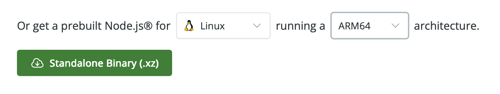

[comment]: # (ClassNode README)

<p align="center">
  
</p>

<h1 align="center">ClassNode</h1>

<p align="center">
  <b>AI Interactive Classroom System</b><br>
  Rooted in the real teaching workflow, letting AI agents blend into every classroom — light, safe, and natural
</p>

<p align="center">
  
  
  
</p>

<p align="center">
  <a href="README.md">简体中文</a> · <span style="font-weight: 600;">English</span>
</p>

---

## Why It Was Built

AI technology is advancing rapidly, and many teachers can skillfully craft excellent AI agents. Yet when they eagerly try to bring these achievements into real classrooms, they are often held back by harsh realities: fragile school networks, tedious account registration, invisible interaction processes, and data that scatters when the bell rings.

**When technology itself is no longer a barrier, the real challenge is deployment.**

ClassNode was born to break through this wall. It is a lightweight, local AI interactive classroom system that delivers a teacher's carefully crafted AI agents to every student's screen — safely, smoothly, regardless of network fluctuations or device differences.

> Turning AI in the classroom from an occasional "worth a try" into a daily "used in every class."

---

## Breaking Through

| Traditional Pain Points | ClassNode's Solution |
| :--- | :--- |
| **Cumbersome registration, hard to distribute** | **Scan to join** — no passwords, no registration, the whole class connects in seconds |
| **Black box process, no visibility into learning** | **Real-time sync** — full panorama on the teacher dashboard, fully visualized monitoring throughout |
| **Internet-dependent, limited by bandwidth** | **LAN-based** — no internet access needed, unafraid of network outages |
| **Data vanishes, nothing left for research** | **Local storage** — complete record of trajectories, one-click Word report export |

---

## Core Features

- **Unified Agent Management** — Supports Coze, Zhipu AI and OpenAI-compatible APIs, with built-in automatic connectivity check
- **Multi-Dimension Teaching Modes** — Flexibly switch between Standard (individual dialogue), Group (collaborative inquiry), and Advanced (differentiated instruction) scenarios
- **Panoramic Classroom Dashboard** — God's-eye real-time monitoring of the whole class; dynamic word clouds and leaderboards make learning clear at a glance
- **Intelligent Content Filtering** — 100+ built-in blocked words, custom rules, auto-lock when the threshold is triggered, keeping the classroom environment safe
- **Data Value Closed Loop** — Runs through the entire flow of "lesson prep → interaction → review"; one-click Word report export and seamless cross-device migration

---

## Quick Start

### Install from Package (Recommended)

Download the installer for your platform from the [Release page](https://gitcode.com/weixin_41523975/classnode/releases). Double-click to install:

| Platform | Package |
|------|--------|
| macOS Apple Silicon | `ClassNode_1.x.x_macos_apple-silicon.dmg` |
| macOS Intel | `ClassNode_1.x.x_macos_intel.dmg` |
| Windows (64-bit) | `ClassNode_1.x.x_x64-setup.exe` |
| Windows (32-bit) | `ClassNode_1.x.x_x32-setup.exe` |

### Deploy from Source

> macOS and Windows users should use the installer package — this section is for **Linux** users only.

#### Step 1: Install Node.js

Visit the [Node.js official website](https://nodejs.org) to download the LTS precompiled binary for Linux, or use the command line directly:

**Download from the website:**



**Or download via command line:**

```bash
mkdir -p ~/software && cd ~/software
wget https://nodejs.org/dist/v24.16.0/node-v24.16.0-linux-arm64.tar.xz
```

**Extract and rename (using UOS ARM64 as an example):**

```bash
tar -xvf node-v24.16.0-linux-arm64.tar.xz
mv node-v24.16.0-linux-arm64 nodejs24
```

**Set up environment variables:**

```bash
echo 'export PATH=$HOME/software/nodejs24/bin:$PATH' >> ~/.bashrc
source ~/.bashrc
```

**Verify installation:**

```bash
node -v   # Expected output: v24.16.0
npm -v    # Expected output: corresponding npm version
```

> Download `linux-x64` for x86 CPUs or `linux-arm64` for ARM CPUs.

#### Step 2: Change npm registry (recommended for China users)

```bash
npm config set registry https://registry.npmmirror.com
npm config get registry
```

#### Step 3: Deploy ClassNode

Download the **Source code** archive from the [Release page](https://gitcode.com/weixin_41523975/classnode/releases) (e.g. `classnode-v1.x.x.zip`), extract it, open a terminal in the extracted directory, and run the startup script:

```bash
# Enter the extracted directory (using v1.3.4 as an example)
cd classnode-v1.3.4

# Grant execute permission to the startup script (first time only)
chmod +x start-classnode-linux.sh

# Run the startup script
./start-classnode-linux.sh
```

The first run will automatically install dependencies and build (about 1-5 minutes, requires internet). Subsequent starts will be much faster.

Access after startup:

- Teacher Console: `http://localhost:3001/teacher`
- Student Portal: `http://localhost:3001/classroom`

> For student devices on the same LAN, replace `localhost` with the teacher's LAN IP address.

---

## Changelog

<details>
<summary>v1.3.5 — 2026-06-07 (Latest)</summary>

#### Agent Connectivity Optimization
- Removed periodic health checks, now only checks on startup to save API quota
- Real-time teacher notification when student-AI connection fails
- Keep manual per-agent test button

#### Content Filtering Enhancement
- System and custom blocked words now support one-click enable/disable
- Disabled words appear semi-transparent and are excluded from filtering

#### QR Code Fix
- Added ClassNode logo overlay to the classroom dashboard QR code
- Added QR code image download feature

#### Student UI Improvements
- Display room code in the chat header

### Fixes

- Fixed build script including old logo files
- Fixed floating prompts pushing the input area down
</details>

<details>
<summary>v1.3.4 — 2026-06-06</summary>

#### About Page Redesign
- Added a developer story section, using a "The Origin" letter-paper design to tell the story behind ClassNode
- Added a tech foundation quad-grid area, highlighting lightweight deployment, local data, and LAN-based advantages
- Redesigned the Hero area with clearer layout for logo, name, version, and changelog button
- Increased font size overall, with more spacious typography and greatly improved visual quality

#### Guide Page UI Optimization
- Each sidebar entry split into a two-line display — bold main title on top, smaller subtitle below
- Increased overall font size, refined layout details
</details>

<details>
<summary>v1.3.3 — 2026-06-06</summary>

#### QR Code Download with Logo
- Added QR code image download to the teacher console's "Cast Code" feature; the generated QR code has the ClassNode logo embedded in the center

#### Windows Installer Language
- Windows NSIS installer now supports Simplified Chinese; the installation interface automatically displays Chinese on Chinese-language systems
</details>

<details>
<summary>v1.3.1 — 2026-06-05</summary>

#### QR Code Added to Classroom Access
- After entering a classroom, teachers can click "Cast Code" to display a QR code + URL + 4-digit room code
- Students can scan the QR code with their phone or tablet to automatically jump to the classroom page, no need to manually enter the room code
- Added a "Show Room Code" button on classroom cards on the dashboard homepage for quick viewing without entering the classroom

#### Optimization
- Cast code display enlarged for visibility from the back of the classroom on large screens
</details>

<details>
<summary>v1.2.4 — 2026-06-05</summary>

#### Dashboard Redesign
- Fully introduced the recharts chart library, replacing custom SVG donut charts with BarChart / PieChart
- Added core KPI row at the top (agents/classes/students/active classrooms/total interactions), clear at a glance
- Four-quadrant layout: AI Agents, Class Management, Classroom Management, Data Management

#### System Block Words Support Individual Deletion
- After expanding a system block word category, each word now shows a delete button on the right
- "Reset to Preset" restores all deleted default block words with one click
</details>

<details>
<summary>v1.2.3 — 2026-06-05</summary>

#### Agent Connectivity Auto-Check
- Added a background periodic detection service that periodically tests all enabled agents' API connectivity at a configurable interval
- Supports manual test per agent and "Check All" batch testing with one click

#### Block Words Library Upgrade
- 100+ preset block words built in, covering four categories: profanity, adult content, violence, self-harm
- Auto-populated on first startup

#### Classroom Management Enhancement
- Classroom dashboard now shows mode labels (Standard / Group / Advanced)
- Group and Advanced modes display real student member lists in groups

#### Bug Fixes
- Prevented multiple application instances from starting
- Fixed block word violation warning events not being properly pushed to the teacher dashboard
- Fixed student block/unblock events not syncing to the teacher dashboard
</details>

---

## Contact

Xingchang Zhang · Gongshu Education Research Institute, Hangzhou  
[hzzxc2012@163.com](mailto:hzzxc2012@163.com)
